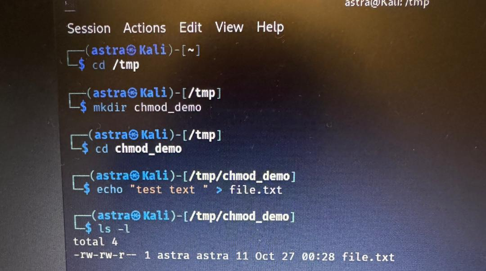
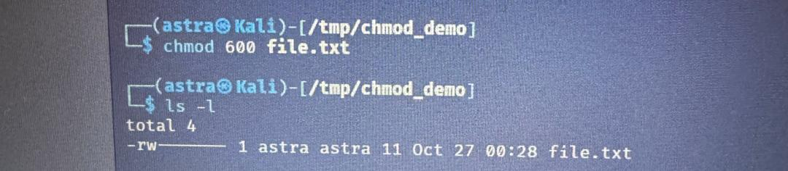
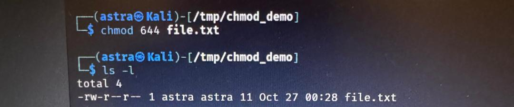
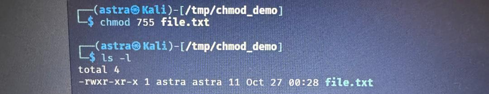
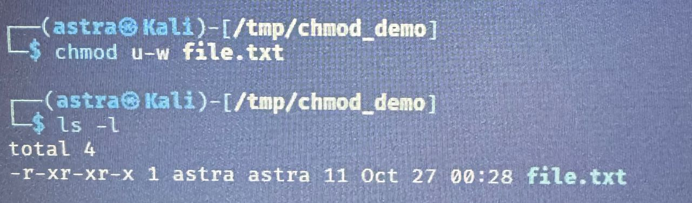
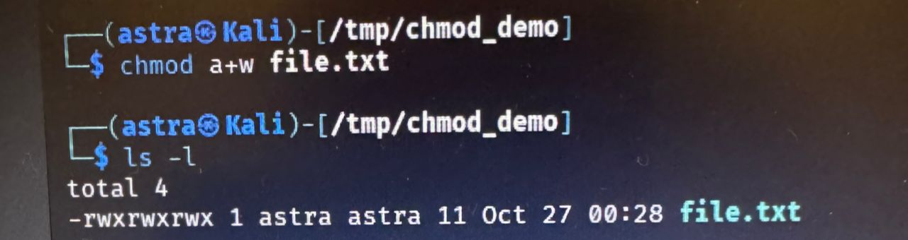
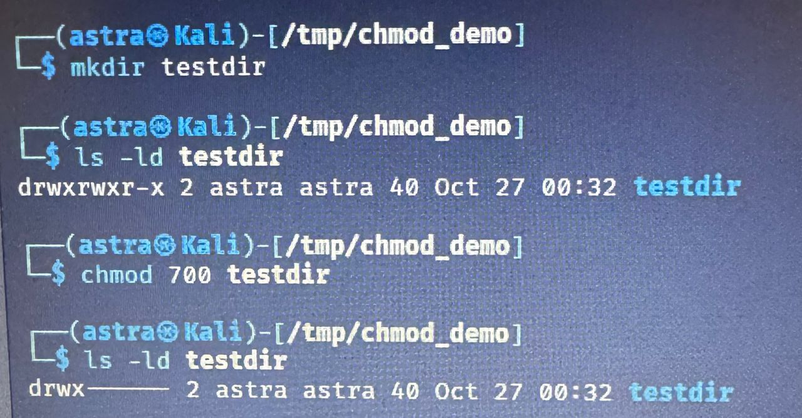
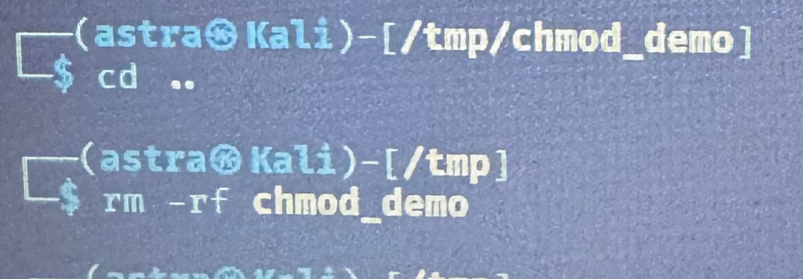

## Лабораторная работа №2

**Задача:** Ознакомиться с системой прав доступа в операционной системе Linux и научиться изменять права на файлы с помощью команды chmod в символьной и числовой форме. 

**1.**

Сначала я перешла в папку /tmp и создала внутри неё новую папку chmod_demo. В ней я создала обычный текстовый файл file.txt, чтобы на нём можно было удобно показывать изменение прав. После создания файла я выполнила команду ls -l, чтобы посмотреть, какие права ему назначены по умолчанию. Обычно новый файл получает права -rw-r--r--, то есть владелец может читать и изменять, а все остальные пользователи — только читать.

**2.**

Дальше я показала первый пример — убрала все права, кроме владельца, командой chmod 600 file.txt. После этого файл мог читать и редактировать только владелец, а другие пользователи — вообще не имели доступа. Это хорошо видно в выводе команды ls -l: там остаётся rw-------.

**3.**

Во втором примере я сделала файл доступным для всех на чтение, выполнив chmod 644 file.txt. Теперь владелец всё ещё мог писать, а все остальные пользователи могли только просматривать содержимое. Это стандартный вариант для большинства текстовых файлов в системе.

**4.**

Третий пример был о том, как сделать файл исполняемым, то есть чтобы его можно было запускать как программу. Для этого я ввела chmod 755 file.txt. После этого права стали rwxr-xr-x, и теперь файл можно было не только читать, но и выполнять.

**5.**

В четвёртом примере я показала, как можно убрать у владельца право на запись, с помощью команды chmod u-w file.txt. В этом случае даже владелец не мог бы изменить содержимое файла — он становился только для чтения.

**6.**

Потом я продемонстрировала, как добавить всем пользователям возможность записи — командой chmod a+w file.txt. После этого права изменились, и теперь любой пользователь системы мог изменять содержимое этого файла.

**7.**

Затем я перешла к демонстрации работы с папками. Я создала новую папку testdir и посмотрела её права. После этого изменила их командой chmod 700 testdir, чтобы только владелец мог заходить в эту директорию и изменять её содержимое. Это важно, потому что для каталогов права означают немного другое: x — это возможность войти, w — возможность добавлять и удалять файлы внутри, а r — возможность видеть список файлов.

**8.**

Когда я закончила демонстрацию, я вышла из папки командой cd .., чтобы подняться на уровень выше, обратно в /tmp. После этого я очистила всё, что создала, командой rm -rf chmod_demo. Эта команда полностью удаляет указанную папку и всё, что внутри неё. В моём случае были удалены файл file.txt и папка testdir. Сама папка /tmp, конечно, осталась, так как она системная и мы удаляли только то, что находилось внутри неё.
